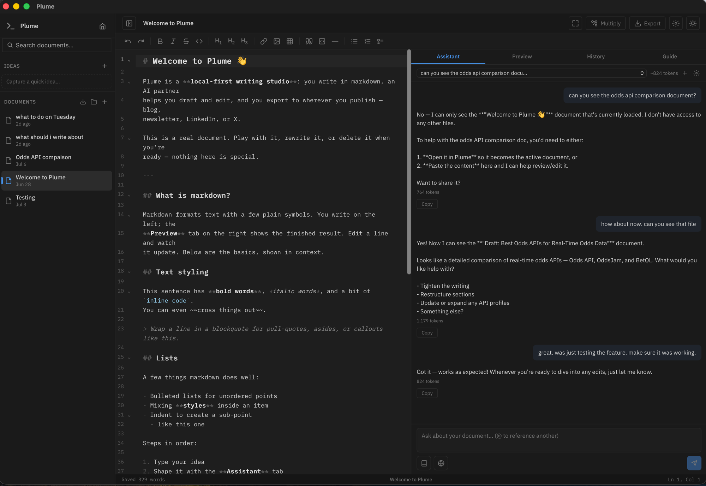

# Plume

**A local-first AI writing studio.** Write in markdown with an AI partner that
actually knows your work — it can semantically search everything you've written,
bring in reference documents you drop on it, help you draft and edit, and adapt a
finished piece for wherever you publish. Everything stays on your machine.

Built for people who write in markdown and build in public.



## Features

- **Markdown editor** — CodeMirror 6 with syntax highlighting, a formatting
  toolbar, and line wrapping built for prose
- **Live preview** — GitHub-flavored markdown (tables, task lists, footnotes)
  rendered by the same engine that drives every export, plus per-platform
  previews (LinkedIn, X thread, X Article) that show exactly what the clipboard
  export will paste
- **AI writing partner** — streaming chat with your document as context;
  **multiple conversations per document** with token usage shown; threads
  persist across restarts; insert suggestions at the cursor or replace the whole
  document with one click. Works with **Anthropic** or **OpenRouter** (any model
  they serve)
- **Search your notes** — the assistant can **semantically search across
  everything you've written** and answer grounded in your own documents, naming
  its sources. The embedding model runs **entirely on your machine** — your
  writing never leaves it. It's opt-in: download a model once (choose from a few
  curated options) in **Settings → Local search**, and Plume indexes your notes
  in the background
- **Bring in your documents** — import **Markdown, plain text, PDF, and Word
  (.docx)** files via a button or by dropping them on the window. Add each as an
  **editable document**, or as a read-only **Source** the assistant can search
  but you don't edit — add and remove sources freely without cluttering your
  writing
- **Web search** — the assistant can search the web (via Tavily) when you toggle
  it on in a chat
- **Inline AI edit** — select text, get a streamed rewrite previewed in place,
  then accept or reject — no copy-paste round trip through the chat
- **Voice & tone** — describe how your writing should sound once in settings;
  it's injected into every AI request (chat, inline edit, idea expansion) so
  generated text sounds like you
- **Content multiplication** — from a finished piece, generate platform-native
  variants (blog post, newsletter, LinkedIn post, X thread) in your own voice,
  each a linked, editable document
- **Cross-document search + @-mention** — full-text search across everything
  you've written (SQLite FTS5), and @-mention past docs to pull them into the
  chat as context
- **Idea inbox** — capture a half-formed idea in a quick modal without leaving
  what you're writing, optionally let AI expand it into a draft, then convert it
  into a real document when you're ready
- **Version history** — automatic document snapshots you can browse and restore
- **Export anywhere**
  - **LinkedIn** — clipboard-ready text with Unicode bold/italic, real bullets,
    and flattened links (formatting survives the paste)
  - **X (Twitter)** — *thread* mode segments the doc into numbered ≤280-char
    posts; *Article* mode is a rich HTML paste matching the X Article composer.
    Also Mastodon, Bluesky, Threads, Reddit, Discord, and Telegram
  - **HTML** — clean, self-contained semantic document (Google Docs and
    newsletter rich-paste flavors too)
  - **Word (.docx)** — real document structure: built-in heading styles, native
    lists, task-list checkboxes, hyperlinks, embedded images, footnotes, and
    tables with column alignment + header shading
  - **Markdown / plain text** — raw source or stripped text
- **Local-first & private** — everything lives in a SQLite database on your
  machine. API keys are stored in the macOS Keychain and never touch the UI
  layer. The only data that leaves your machine is what you send to your chosen
  AI provider (or the web-search service, if you turn it on)
- Light/dark themes, folders, focus mode, full-document autosave

## Stack

| Layer | Tech |
|---|---|
| Shell | Tauri v2 (Rust) |
| Frontend | SvelteKit (static) · Svelte 5 · TypeScript · CodeMirror 6 |
| Markdown engine | comrak (one parse feeds preview, AI context, and exports) |
| Storage | SQLite via rusqlite (WAL) |
| AI | Anthropic Messages API / OpenRouter, streamed via SSE from Rust |
| Local search | fastembed (bge-small etc.) — on-device embeddings, brute-force cosine |
| Import | pdf-extract (PDF) · zip + quick-xml (DOCX) |
| Documents | docx-rs for Word export |

## Development

Prereqs: Rust ≥ 1.95, Node 22+, pnpm.

```sh
pnpm install
pnpm tauri dev      # run the app with hot reload
```

Verification:

```sh
pnpm check                                        # svelte-check
cargo test --manifest-path src-tauri/Cargo.toml   # Rust unit tests
pnpm tauri build                                  # production bundle
```

Notes for development builds:

- AI keys are stored in a plain `dev-keys.json` in the app data folder instead
  of the Keychain (rebuilds change the binary signature, which would otherwise
  trigger endless password prompts). Release builds use the Keychain.
- The database lives at
  `~/Library/Application Support/com.adamwickwire.markdown/markdown.db`.
- The local-search model downloads to that same app data folder, only when you
  choose to download it in Settings.

## Project docs

- `CLAUDE.md` — architecture map and conventions for AI-assisted development

## Roadmap

v1: editor + AI assistant + LinkedIn/HTML/docx export.

v2: X thread + X Article export (and Mastodon/Bluesky/Threads/Reddit/Discord/
Telegram), multiple chats with token usage, version history + restore, inline AI
edit, idea inbox, Voice & tone, content multiplication, cross-document search +
@-mention, the project shelf home, and server-side context compaction.

v3 (current): a **local semantic notebook** — on-device embeddings, "search your
notes," a curated opt-in model picker, and **document import** (Markdown / text /
PDF / Word) as editable docs or searchable Sources.

Direction: Plume is a markdown workspace for **building in public** — plan a
project, keep its build log, let the AI work across everything you've written,
and turn that real work into quality posts in your voice. Output stays copy/paste
+ export; there is no publishing pipeline.

## License

Copyright 2026 Adam Wickwire. Free and open source under the
[Apache License 2.0](LICENSE).
